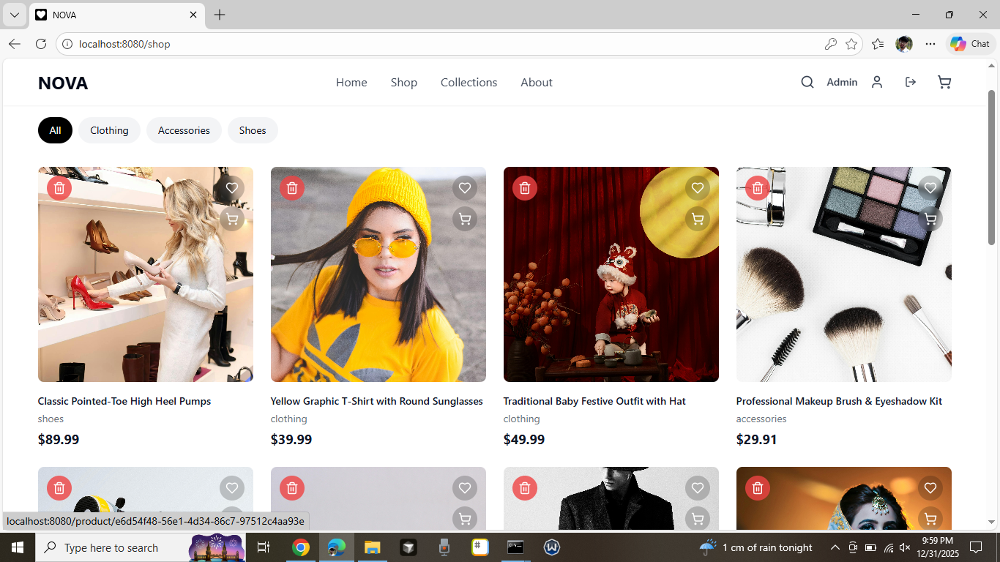
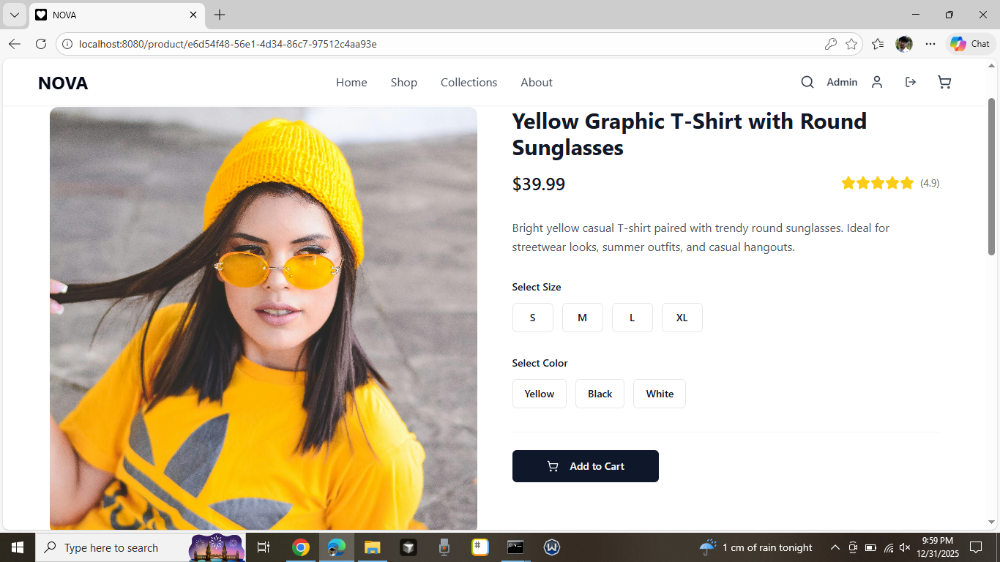
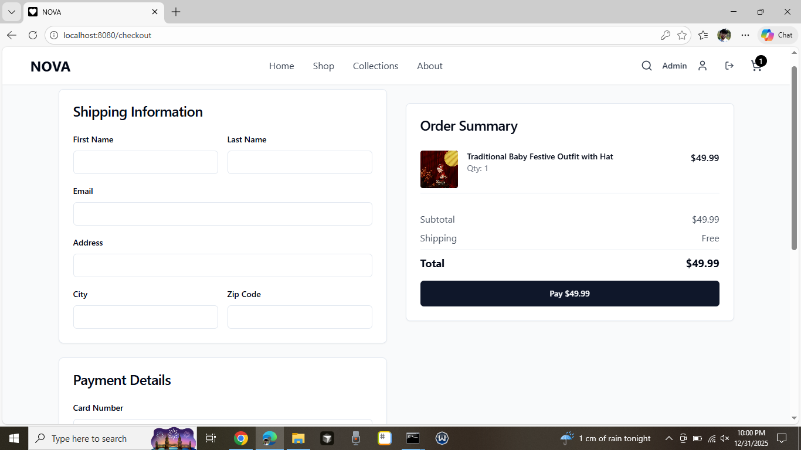
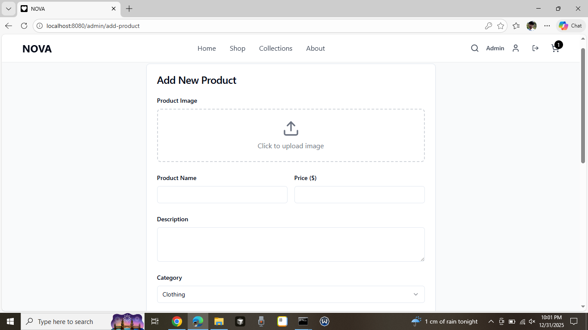
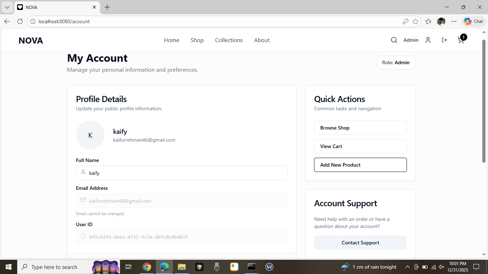

# 🌟 Nova Threads

**Nova Threads** is a modern, full-stack e-commerce application built with **React**, **TypeScript**, and **Supabase**. It features a complete shopping experience including product browsing, cart management, secure checkout, user authentication, and an admin dashboard for inventory management.


## ✨ Features

### 🛍️ Customer Experience
- **Responsive Design:** Fully mobile-responsive UI built with Tailwind CSS.
- **Product Discovery:** Filter products by category (Clothing, Shoes, Accessories) and search by name.
- **Detailed Product Views:** High-quality image galleries, size/color selection, and customer reviews.
- **Smart Cart:** Persistent shopping cart with real-time total calculation and quantity adjustments.
- **Secure Checkout:** Integrated order processing with Supabase backend.
- **User Accounts:** Profile management (avatar, full name) and order history tracking.

### 🛡️ Admin & Security
- **Role-Based Access Control (RBAC):** Special dashboard accessible only to Admins.
- **Inventory Management:** Add new products (image, price, description) and delete obsolete items.
- **Real-time Database:** Instant updates using Supabase Realtime subscriptions.
- **Secure Auth:** Row Level Security (RLS) ensures users can only access their own data.

---

## 🛠️ Tech Stack

### Frontend
- **Framework:** [React](https://react.dev/) + [Vite](https://vitejs.dev/)
- **Language:** [TypeScript](https://www.typescriptlang.org/)
- **Styling:** [Tailwind CSS](https://tailwindcss.com/)
- **Components:** [Shadcn UI](https://ui.shadcn.com/) + [Lucide React](https://lucide.dev/) (Icons)
- **State Management:** React Context API (Cart) + React Query (Server State)

### Backend (BaaS)
- **Database:** [Supabase](https://supabase.com/) (PostgreSQL)
- **Authentication:** Supabase Auth
- **Storage:** Supabase Storage (for product images & avatars)

---

## 📸 Screenshots

### 1. Home & Shop Page


### 2. Product Details & Reviews


### 3. Shopping Cart & Checkout


### 4. Admin Dashboard


### 5. User Account

---

## ⚙️ Local Setup Guide

Follow these steps to run the project locally.

### 1. Clone the Repository
```bash
git clone https://github.com/mkaify/nova-threads.git
cd nova-threads
```
### 2. Install Dependencies
```
npm install
```

### 3. Environment Variables

Create a `.env` file in the root directory and add your Supabase credentials:
```
VITE_SUPABASE_URL=your_supabase_project_url
VITE_SUPABASE_ANON_KEY=your_supabase_anon_key
```

### 4. Database Setup (Supabase)

Run the following SQL in your Supabase **SQL Editor** to set up the tables and security policies:

```
-- Create Profiles Table
CREATE TABLE public.profiles (
  id UUID REFERENCES auth.users(id) ON DELETE CASCADE PRIMARY KEY,
  email TEXT UNIQUE NOT NULL,
  role TEXT DEFAULT 'customer',
  full_name TEXT,
  avatar_url TEXT
);

-- Create Products Table
CREATE TABLE "Products" (
  id UUID DEFAULT gen_random_uuid() PRIMARY KEY,
  name TEXT NOT NULL,
  description TEXT,
  price DECIMAL(10,2) NOT NULL,
  category TEXT,
  image TEXT,
  stock INTEGER DEFAULT 0,
  archived BOOLEAN DEFAULT false
);

-- Enable RLS (Security)
ALTER TABLE public.profiles ENABLE ROW LEVEL SECURITY;
ALTER TABLE "Products" ENABLE ROW LEVEL SECURITY;

-- (Add other tables: Orders, OrderItems, Reviews as needed)
```

### 5. Run the App


```
npm run dev
```

Open [http://localhost:5173](https://www.google.com/search?q=http://localhost:5173) to view it in the browser.


## 🤝 Contributing
Contributions are welcome!

1.  Fork the project.
    
2.  Create your feature branch (`git checkout -b feature/AmazingFeature`).
    
3.  Commit your changes (`git commit -m 'Add some AmazingFeature'`).
    
4.  Push to the branch (`git push origin feature/AmazingFeature`).
    
5.  Open a Pull Request.
    

## 📄 License

Distributed under the MIT License. See `LICENSE` for more information.

----------

### 📬 Contact

**Muhammad Kaif** - [LinkedIn Profile](https://www.linkedin.com/in/muhammad-kaif-ur-rehman-a54114256/) - kaifurrehman46@gmail.com

Project Link: [https://github.com/mkaify/nova-threads](https://www.google.com/search?q=https://github.com/mkaify/nova-threads)s